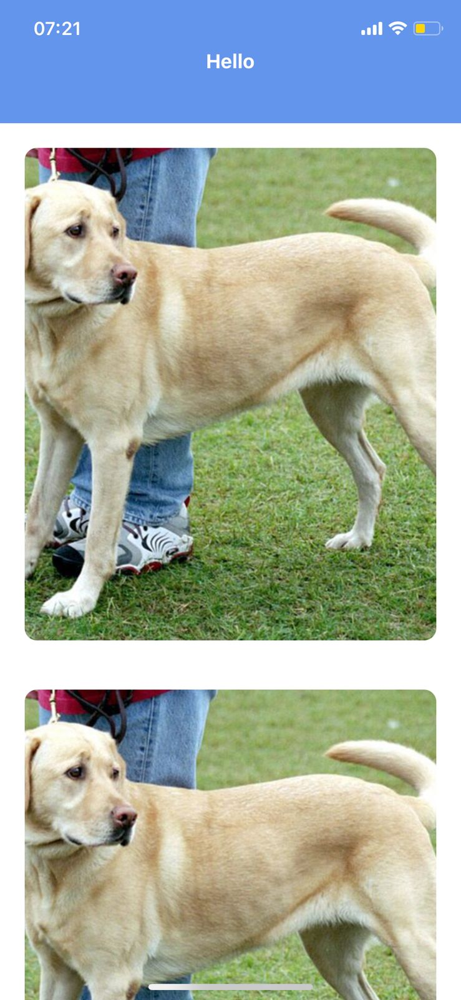

### AIRBNB Header

In this example we are going to create an animated header that hides when the contents of the page scroll and shows immediately when you start scrolling down. We are going to use the `react-native-reanimated` library

### Installation

First we need to install this package by running the following command:

```shell
npx expo install react-native-reanimated
```

### Code

```ts
import { View, Text, ScrollView, Image } from "react-native";
import React from "react";
import Animated from "react-native-reanimated";
const HEADER_HEIGHT: number = 100;

const App = () => {
  const scrollY = React.useRef(new Animated.Value(0)).current;

  const diffClampScrollY = Animated.diffClamp(scrollY, 0, HEADER_HEIGHT);

  const headerY = Animated.interpolateNode(diffClampScrollY, {
    inputRange: [0, HEADER_HEIGHT],
    outputRange: [0, -HEADER_HEIGHT],
  });

  return (
    <View style={{ flex: 1 }}>
      <Animated.View
        style={{
          position: "absolute",
          top: 0,
          width: "100%",
          zIndex: 10,
          height: HEADER_HEIGHT,
          justifyContent: "center",
          alignItems: "center",
          backgroundColor: "cornflowerblue",
          transform: [{ translateY: headerY }],
        }}
      >
        <Text style={{ fontSize: 20, fontWeight: "bold", color: "white" }}>
          Hello
        </Text>
      </Animated.View>
      <Animated.ScrollView
        scrollEventThrottle={16}
        bounces={false}
        style={{ flex: 1, paddingTop: HEADER_HEIGHT }}
        onScroll={Animated.event([
          { nativeEvent: { contentOffset: { y: scrollY } } },
        ])}
      >
        {Array(10)
          .fill(
            "https://upload.wikimedia.org/wikipedia/commons/thumb/6/60/YellowLabradorLooking.jpg/640px-YellowLabradorLooking.jpg"
          )
          .map((img, index) => {
            return (
              <View style={{ height: 400, margin: 20 }} key={index}>
                <Image
                  source={{ uri: img }}
                  style={{ width: "100%", height: "100%", borderRadius: 10 }}
                />
              </View>
            );
          })}
      </Animated.ScrollView>
    </View>
  );
};

export default App;
```

### Demo

<p align="center"></p>

### Refs

1. [react-native-reanimated](https://docs.swmansion.com/react-native-reanimated/docs/fundamentals/installation)
