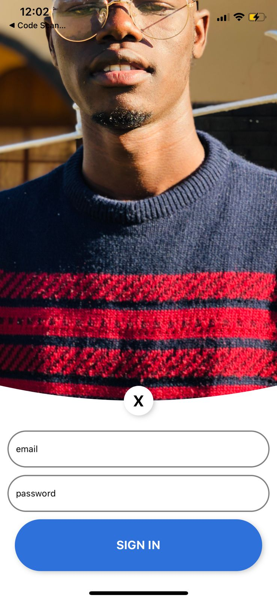

### Animated Login

Demo:

<p align="center"></p>

In this one we are going to learn how to cache static files together with creating an animated login. First let's implement the caching part. in the `App.tsx` we are going to add the following. Note that we need to install `expo-app-loading` first as follows:

```shell
npx expo install expo-app-loading
```

This is how we can `cache` some asserts from either a local or a `remote` url.

```ts
import { StatusBar } from "expo-status-bar";
import { Asset } from "expo-asset";
import { StyleSheet, Text, View, Image } from "react-native";
import React from "react";
import AppLoading from "expo-app-loading";

const _loadAssetsAsync = async () => {
  const imageAssets = cacheImages([require("./assets/me.jpeg")]);
  await Promise.all([...imageAssets]);
};
const cacheImages = (images: any[]) => {
  return images.map((image) => {
    if (typeof image === "string") {
      return Image.prefetch(image);
    } else {
      return Asset.fromModule(image).downloadAsync();
    }
  });
};
export default function App() {
  const [ready, setReady] = React.useState<boolean>(false);
  if (!ready)
    return (
      <AppLoading
        startAsync={_loadAssetsAsync}
        onFinish={() => setReady(true)}
        onError={console.warn}
      />
    );
  return (
    <View style={styles.container}>
      <Text>Open up App.tsx to start working on your app!</Text>
      <StatusBar style="auto" />
    </View>
  );
}
```

This method seems to be deprecated now we can use `expo-splash-screen` now let's go and add it:

```shell
npx expo install expo-splash-screen
```

Now we change our `App.tsx` to look as follows:

```tsx
import { StatusBar } from "expo-status-bar";
import { Asset } from "expo-asset";
import { StyleSheet, Text, View, Image } from "react-native";
import React from "react";
import * as SplashScreen from "expo-splash-screen";

const _loadAssetsAsync = async () => {
  const imageAssets = cacheImages([require("./assets/me.jpeg")]);
  await Promise.all([...imageAssets]);
};
const cacheImages = (images: any[]) => {
  return images.map((image) => {
    if (typeof image === "string") {
      return Image.prefetch(image);
    } else {
      return Asset.fromModule(image).downloadAsync();
    }
  });
};
SplashScreen.preventAutoHideAsync();
export default function App() {
  const [ready, setReady] = React.useState<boolean>(false);

  React.useEffect(() => {
    (async () => {
      try {
        await _loadAssetsAsync();
      } catch (error) {
        console.warn(error);
      } finally {
        setReady(true);
      }
    })();
  }, []);
  const onLayoutRootView = React.useCallback(async () => {
    if (ready) {
      await SplashScreen.hideAsync();
    }
  }, [ready]);
  if (!ready) return null;
  return (
    <View style={styles.container} onLayout={onLayoutRootView}>
      <Text>Open up App.tsx to start working on your app!</Text>
      <StatusBar style="auto" />
    </View>
  );
}
```

Now that we have learnt about that let's go and create our login animation. We will create it in the `Login.tsx` file. First we need to install the following packages:

```shell
npx expo install react-native-reanimated react-native-gesture-handler react-native-svg
```

In our Login component we are going to add the following code to it

```tsx
import { View, Text, Dimensions, StyleSheet, TextInput } from "react-native";
import React from "react";
import Svg, { Image, Circle, ClipPath } from "react-native-svg";
import { TapGestureHandler, State } from "react-native-gesture-handler";
import Animated, {
  EasingNode,
  Value,
  event,
  block,
  cond,
  eq,
  set,
  Clock,
  startClock,
  stopClock,
  debug,
  timing,
  clockRunning,
  Extrapolate,
  concat,
} from "react-native-reanimated";
const { width, height } = Dimensions.get("window");

const runTiming = (clock: any, value: any, dest: any) => {
  const state = {
    finished: new Value(0),
    position: new Value(0),
    time: new Value(0),
    frameTime: new Value(0),
  };

  const config = {
    duration: 1000,
    toValue: new Value(0),
    easing: EasingNode.inOut(EasingNode.ease),
  };

  return block([
    cond(clockRunning(clock), 0, [
      set(state.finished, 0),
      set(state.time, 0),
      set(state.position, value),
      set(state.frameTime, 0),
      set(config.toValue, dest),
      startClock(clock),
    ]),
    timing(clock, state, { ...(config as any) }),
    cond(state.finished, debug("stop clock", stopClock(clock))),
    state.position,
  ]);
};
const Login = () => {
  const btnOpacity = React.useRef(new Value(1)).current;
  const onStateChange = event([
    {
      nativeEvent: ({ state }: any) =>
        block([
          cond(
            eq(state, State.END),
            set(btnOpacity, runTiming(new Clock(), 1, 0))
          ),
        ]),
    },
  ]);

  const onCloseState = event([
    {
      nativeEvent: ({ state }: any) =>
        block([
          cond(
            eq(state, State.END),
            set(btnOpacity, runTiming(new Clock(), 0, 1))
          ),
        ]),
    },
  ]);

  const buttonY = btnOpacity.interpolate({
    inputRange: [0, 1],
    outputRange: [100, 0],
    extrapolate: Extrapolate.CLAMP,
  });

  const bgY = btnOpacity.interpolate({
    inputRange: [0, 1],
    outputRange: [-height / 3 - 50, 0],
    extrapolate: Extrapolate.CLAMP,
  });
  const textInputZIndex = btnOpacity.interpolate({
    inputRange: [0, 1],
    outputRange: [1, -1],
    extrapolate: Extrapolate.CLAMP,
  });
  const textInputY = btnOpacity.interpolate({
    inputRange: [0, 1],
    outputRange: [0, 100],
    extrapolate: Extrapolate.CLAMP,
  });
  const textInputOpacity = btnOpacity.interpolate({
    inputRange: [0, 1],
    outputRange: [1, 0],
    extrapolate: Extrapolate.CLAMP,
  });
  const rotateCross = btnOpacity.interpolate({
    inputRange: [0, 1],
    outputRange: [180, 360],
    extrapolate: Extrapolate.CLAMP,
  });

  return (
    <View
      style={{ flex: 1, backgroundColor: "white", justifyContent: "flex-end" }}
    >
      <Animated.View
        style={[StyleSheet.absoluteFill, { transform: [{ translateY: bgY }] }]}
      >
        <Svg height={height + 50} width={width}>
          <ClipPath id="clip">
            <Circle r={height + 50} cx={width / 2} />
          </ClipPath>
          <Image
            height={height + 50}
            width={width}
            href={require("./assets/me.jpeg")}
            preserveAspectRatio="xMidYMid slice"
            clipPath="url(#clip)"
          />
        </Svg>
      </Animated.View>
      <View style={{ height: height / 3, justifyContent: "center" }}>
        <TapGestureHandler onHandlerStateChange={onStateChange}>
          <Animated.View
            style={[
              styles.button,
              { opacity: btnOpacity, transform: [{ translateY: buttonY }] },
            ]}
          >
            <Text style={{ fontSize: 20, fontWeight: "bold" }}>SIGN IN</Text>
          </Animated.View>
        </TapGestureHandler>

        <Animated.View
          style={[
            styles.button,
            {
              backgroundColor: "#2E71DC",
              opacity: btnOpacity,
              transform: [{ translateY: buttonY }],
            },
          ]}
        >
          <Text style={{ fontSize: 20, fontWeight: "bold", color: "white" }}>
            SIGN IN WITH FACEBOOK
          </Text>
        </Animated.View>

        <Animated.View
          style={[
            StyleSheet.absoluteFill,
            {
              height: height / 3,
              top: 0,
              justifyContent: "center",
              opacity: textInputOpacity,
              zIndex: textInputZIndex,
              transform: [{ translateY: textInputY }],
            },
          ]}
        >
          <TapGestureHandler onHandlerStateChange={onCloseState}>
            <Animated.View
              style={{
                width: 40,
                height: 40,
                borderRadius: 40,
                backgroundColor: "white",
                alignItems: "center",
                justifyContent: "center",
                top: -20,
                left: width / 2 - 20,
                position: "absolute",
                shadowOffset: { width: 2, height: 2 },
                shadowColor: "black",
                shadowOpacity: 0.2,
              }}
            >
              <Animated.Text
                style={{
                  fontSize: 25,
                  color: "black",
                  fontWeight: "bold",
                  transform: [{ rotate: concat(rotateCross, "deg") }],
                }}
              >
                X
              </Animated.Text>
            </Animated.View>
          </TapGestureHandler>
          <TextInput
            placeholder="email"
            placeholderTextColor={"black"}
            style={{
              height: 50,
              borderRadius: 25,
              borderWidth: 1.5,
              paddingLeft: 10,
              borderColor: "gray",
              marginHorizontal: 10,
              marginVertical: 5,
            }}
          />
          <TextInput
            placeholder="password"
            placeholderTextColor={"black"}
            style={{
              height: 50,
              borderRadius: 25,
              borderWidth: 1.5,
              paddingLeft: 10,
              borderColor: "gray",
              marginHorizontal: 10,
              marginVertical: 5,
            }}
          />
          <Animated.View
            style={[
              styles.button,
              {
                shadowOffset: { width: 2, height: 2 },
                shadowColor: "black",
                shadowOpacity: 0.2,
                backgroundColor: "#2E71DC",
                zIndex: textInputZIndex,
              },
            ]}
          >
            <Text
              style={{
                fontSize: 20,
                fontWeight: "bold",

                color: "white",
              }}
            >
              SIGN IN
            </Text>
          </Animated.View>
        </Animated.View>
      </View>
    </View>
  );
};

export default Login;

const styles = StyleSheet.create({
  container: {
    flex: 1,
    alignItems: "center",
    justifyContent: "center",
  },
  button: {
    backgroundColor: "white",
    height: 70,
    marginHorizontal: 20,
    borderRadius: 35,
    alignItems: "center",
    justifyContent: "center",
    marginVertical: 5,
  },
});
```
