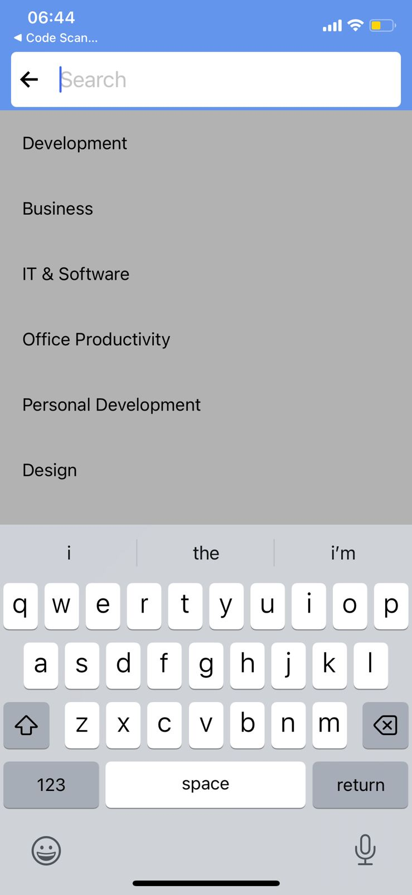

### Udemy Search Bar

In this one we are going to create a simple search bar that is animated using the `react-native-animatable` library:

### Installation

First we need to install `react-native-animatable` by running the following command.

```shell
yarn add react-native-animatable
```

### Code

This is the code for doing that.

```ts
import React from "react";
import {
  Text,
  View,
  TextInput,
  FlatList,
  StatusBar,
  SafeAreaView,
} from "react-native";
import * as Animatable from "react-native-animatable";
const listItems = [
  "Development",
  "Business",
  "IT & Software",
  "Office Productivity",
  "Personal Development",
  "Design",
  "Marketing",
  "LifeStyle",
  "Photography",
  "Health & Fitness",
  "Teacher Training",
  "Music",
];
import { Ionicons } from "@expo/vector-icons";

export default function App() {
  const [focused, setFocused] = React.useState<boolean>(false);
  return (
    <View style={{ flex: 1 }}>
      <StatusBar barStyle={"light-content"} />
      <SafeAreaView
        style={{
          height: 100,
          backgroundColor: "cornflowerblue",
          justifyContent: "center",
          paddingHorizontal: 5,
        }}
      >
        <Animatable.View
          animation="slideInRight"
          duration={500}
          style={{
            height: 50,
            backgroundColor: "white",
            flexDirection: "row",
            padding: 5,
            alignItems: "center",
            marginHorizontal: 10,
            borderRadius: 5,
          }}
        >
          <Animatable.View
            animation={focused ? "fadeInLeft" : "fadeInRight"}
            duration={400}
          >
            {focused ? (
              <Ionicons name="arrow-back-outline" size={24} color="black" />
            ) : (
              <Ionicons name="search-sharp" size={24} color="black" />
            )}
          </Animatable.View>
          <TextInput
            placeholder="Search"
            style={{ fontSize: 24, marginLeft: 15, flex: 1 }}
            onBlur={() => setFocused((state) => !state)}
            onFocus={() => setFocused((state) => !state)}
          />
        </Animatable.View>
      </SafeAreaView>
      <FlatList
        style={{ backgroundColor: focused ? "rgba(0,0,0,0.3)" : "white" }}
        data={listItems}
        renderItem={({ item }) => (
          <Text style={{ padding: 20, fontSize: 20 }}>{item}</Text>
        )}
        keyExtractor={(item, index) => index.toString()}
      />
    </View>
  );
}
```

### Output

<p align="center"></p>

### Refs

1.[react-native-animatable](https://github.com/oblador/react-native-animatable)
